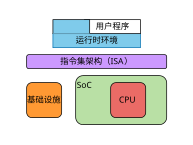
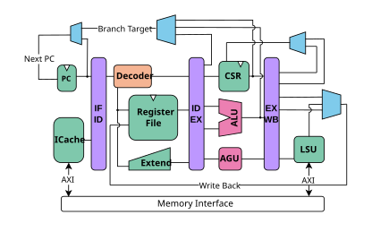
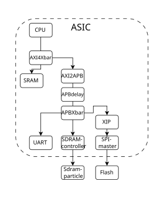
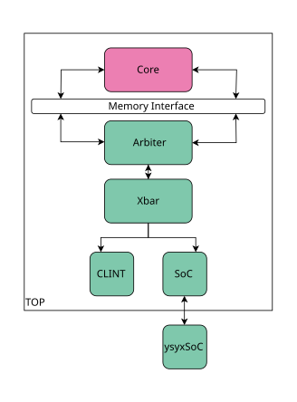
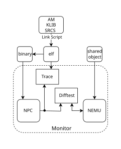
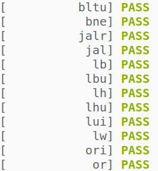
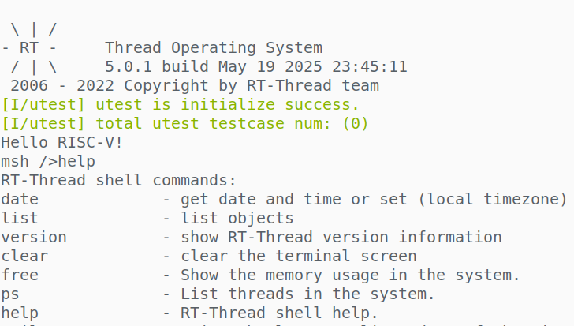

# 基于 RISC-V 的 32 位处理器设计与实现

本文在实现 RV32E 指令集模拟器 NEMU 的基础上，设计四级流水线、顺序单发射的 32 位 RISC-V 处理器 NPC，并将其接入 ysyxSoC。围绕处理器设计、SoC 集成、验证与调试基础设施、裸机运行时环境和微体系结构优化，完成了一套面向 ASIC 流程的处理器系统实现。

<p align="center">
  
  <br>
  <sub>研究内容总览</sub>
</p>

## 研究内容

主要工作包括：

- 实现 RV32E 的大部分指令与通用寄存器，以及用于上下文切换、异常处理和性能分析的部分 CSR。
- 设计四级流水线、顺序单发射处理器，功能单元间采用 Valid/Ready 协议通信。
- 实现 Arbiter、Xbar 等访存模块，将处理器接入包含 SRAM、SDRAM、SPI Flash 和 UART 等设备的 SoC 环境。
- 建设基于 Verilator 的仿真与调试基础设施，以 NEMU 为参考模型实现 Difftest，并完成 NPC/ysyxSoC 的 AM 平台适配。
- 完善 Klib、链接脚本与启动流程，使同一套裸机程序能够运行于 NEMU 和 NPC/ysyxSoC。
- 以 Microbench 为基准程序，通过性能计数器分析瓶颈，对 Cache、主频和流水线进行量化评估与优化。

## 前期基础：NEMU

在设计硬件处理器 NPC 前，基于课程框架实现 RV32E 指令集模拟器 NEMU，完成大部分指令的译码与执行、时钟/键盘/显示等设备模型，以及异常处理与上下文切换；同时实现调试器和指令、访存、函数调用追踪基础设施。

基于 Abstract Machine（AM）接口完成 NEMU 平台的裸机 C 运行时适配并完善 Klib，通过 RISC-V 指令测试，运行 Microbench、设备测试与游戏程序。后续硬件设计复用同一套 AM/Klib 上层接口，并以 NEMU 为参考模型对 NPC 进行 Difftest。

## 处理器架构

NPC 是一个四级流水线、顺序单发射的 32 位 RISC-V 处理器，采用 RV32E 指令集架构。

<p align="center">
  
  <br>
  <sub>NPC 处理器架构</sub>
</p>

## SoC 与访存系统

处理器通过访存接口连接内部与外部设备，并使用 Arbiter 处理多主设备竞争，使用 Xbar 完成不同地址空间的请求路由。

<p align="center">
  
  
  <br>
  <sub>SoC 结构与访存模块</sub>
</p>

## 基础设施与运行时环境

基于 Verilator 搭建周期级仿真环境，通过 Monitor、Trace 和 Difftest 提供程序级、指令级和信号级的调试能力；基于 AM 接口分别适配 NEMU 与 NPC/ysyxSoC 平台，并复用 Klib 和上层测试程序，最终支持裸机程序及 RT-Thread 运行。

<p align="center">
  
  <br>
  <sub>基础设施与运行时环境</sub>
</p>

## 验证结果

| 项目 | 结果 |
| --- | --- |
| 指令集 | RV32E |
| 微架构 | 四级流水线、顺序单发射 |
| 功能验证 | 通过移植到 AM 的 RISC-V 指令测试 |
| 系统验证 | 成功启动 RT-Thread |
| 综合主频 | 500 MHz |
| 处理器面积 | 26710.39 μm² |
| IPC | 0.022 |

<p align="center">
  
  
</p>

## 仓库结构

```text
.
├── thesis.typ       # 最终论文入口
├── chapters/        # 七章论文正文
├── slides.typ       # 答辩幻灯片
├── dewdrop.typ      # 幻灯片主题
├── images/          # 架构图、分析图和实验截图
└── ref.bib          # 参考文献
```

本仓库只保存论文和答辩材料，处理器及 SoC 实现代码位于相关代码仓库。

## 编译

安装 Typst：

```bash
brew install typst
```

生成论文 PDF：

```bash
typst compile thesis.typ thesis.pdf
```

论文使用南京大学 Typst 模板 `modern-nju-thesis:0.4.0`，首次编译时会自动下载。

## 相关仓库

- [ysyx](https://github.com/Rom00000010/ysyx)：NEMU、NPC、仿真与调试基础设施，以及 AM/Klib 运行时适配
- [ysyxSoC](https://github.com/Rom00000010/ysyxSoC)：SoC 集成与相关实现
